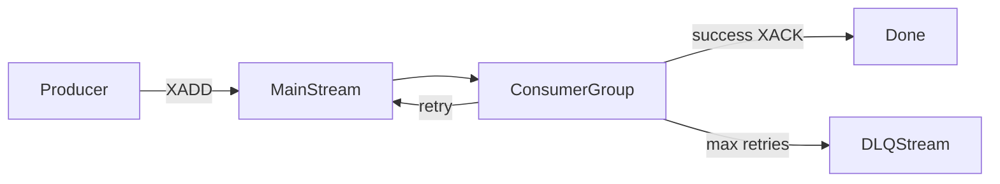

# redis-streams-messaging

Producer/consumer abstraction over **Redis Streams** with retries and **dead-letter queue (DLQ)** support — implemented in **Python** and **Java** with shared semantics.

Inspired by cross-language messaging libraries used in high-throughput production pipelines; this repo is a readable open-source reference (standalone Redis, not cluster).

## Why Redis Streams?

| | Redis Streams | Kafka |
|---|---------------|-------|
| Ops | Often already in stack | Separate cluster |
| Throughput | Strong for many workloads | Higher at huge scale |
| Fit | Task queues, fan-out, micro-batch | Event backbone |

## Flow



## Design decisions

1. **Consumer groups** — at-least-once delivery; scale consumers horizontally.
2. **Envelope** — every message: `id`, `attempt`, `timestamp`, `payload` (JSON).
3. **DLQ** — failed messages go to `{stream}:dlq` with `dlq_error` metadata.
4. **Idempotency** — handlers should be idempotent; wrapper does not dedupe.
5. **Cross-language** — Python (`redis-py`) and Java (**Lettuce**) share stream names and envelope schema.

Production systems may use Redis Cluster; this demo targets standalone Redis for simpler local runs.

## Quick start

```bash
docker compose up -d
```

### Python

```bash
cd python
python -m venv .venv && source .venv/bin/activate
pip install -e ".[dev]"
python examples/producer_demo.py
python examples/consumer_demo.py
pytest
```

### Java

```bash
cd java
mvn test
```

## API (parallel)

| | Python | Java |
|---|--------|------|
| Publish | `StreamProducer.publish(stream, dict)` | `StreamProducer.publish(stream, Map)` |
| Consume | `StreamConsumer.consume(stream, handler)` | `StreamConsumer.consume(stream, handler, max)` |
| DLQ stream | `{stream}:dlq` | same |

## Configuration

| Field | Default |
|-------|---------|
| `redis_url` | `redis://localhost:6379` |
| `group_name` | `app-consumers` |
| `consumer_name` | `consumer-1` |
| `max_retries` | `3` |

## Tests

- Python: `fakeredis` unit tests
- Java: Testcontainers + Redis 7
